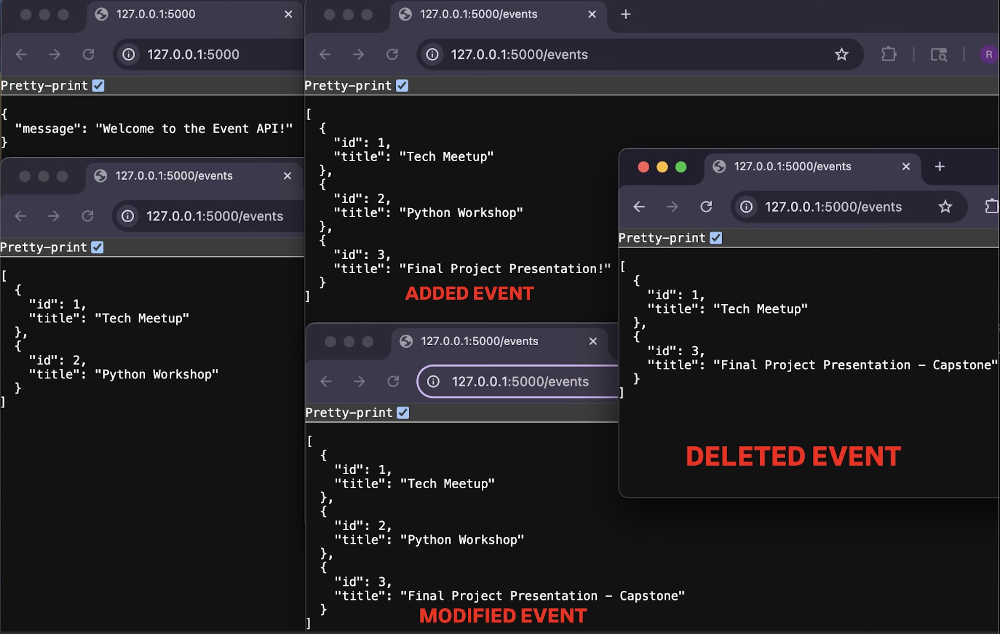

# Getting Full CRUD with Flask Lab

This project implements a simple Flask-based RESTful API that supports full CRUD (Create, Read, Update, Delete) operations on an in-memory list of “events", like:
- **Create** new events  
- **Read** all events or a single event by ID  
- **Update** an event’s title  
- **Delete** events  

## Table of Contents
- [Demo](#demo)  
- [Setup](#setup)  
- [Testing](#testing)  
- [Features](#features)  
- [Usage](#usage)
- [Endpoints](#endpoints)  

## Demo

---

## Setup
1. Fork & Clone the repo
2. Install dependencies: 
  `pipenv install`
  `pipenv shell`
3. Run the server: `python app.py`

---

## Testing
Run the test suite: `pytest`

---

## Features
	•	Welcome route (GET /) returns a JSON welcome message
	•	List events (GET /events) returns an array of all events
	•	Create event (POST /events) accepts { "title": "Our Title" } and returns the new event with status 201
	•	Update event (PATCH /events/<id>) accepts { "title": "New Title" } and returns the updated event (or 404 if not found)
	•	Delete event (DELETE /events/<id>) removes an event and returns 204 (or 404 if not found)

---

## Usage
- Run server: `python app.py`

In second terminal and:
- Check the welcome route
  curl -i http://127.0.0.1:5000/

- List all events
  curl -i http://127.0.0.1:5000/events

- Create a new event
  curl -i -X POST http://127.0.0.1:5000/events -H "Content-Type: application/json" -d '{"title":"Final Project Presentation!"}'

-Verify it was added:
  curl -i http://127.0.0.1:5000/events (or refresh the browser)

- Update that event’s title (assuming it got ID 3)
  curl -i -X PATCH http://127.0.0.1:5000/events/3 -H "Content-Type: application/json" -d '{"title":"Final Project Presentation - Capstone"}'

- Verify change:
  curl http://127.0.0.1:5000/events (or refresh the browser)

- Delete the event
  curl -i -X DELETE http://127.0.0.1:5000/events/2

- Verify deletion
  curl http://127.0.0.1:5000/events (or refresh the browser)

---

## Endpoints

• Method: GET | Route: / | Welcome message
• Method: GET | Route: /events | List all events
• Method: POST | Route: /events | Create a new event
• Method: PATCH | Route: /events/<id> | Update title of event with given id
• Method: DELETE |  Route: /events/<id> | Delete event with given id